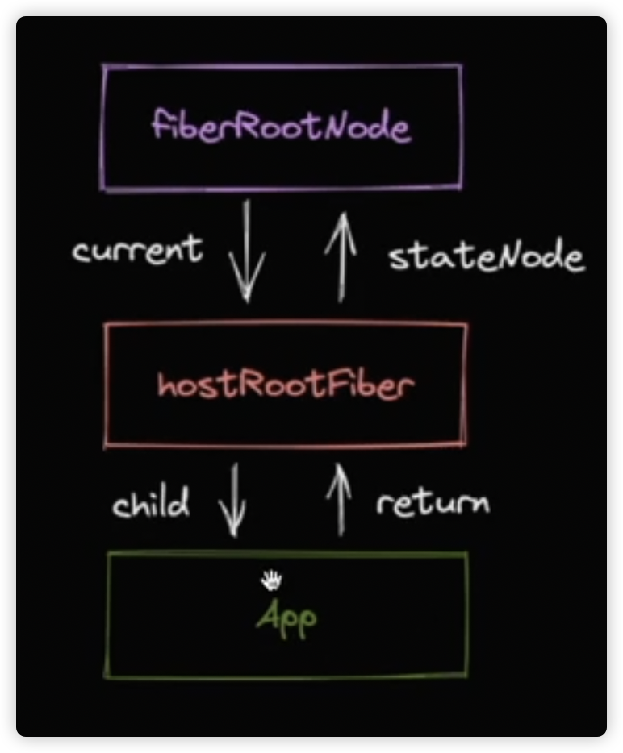

# 将一个包link到全局的node_modules下

1. 进入到包的根目录下
2. 执行如下命令
   > pnpm link --global
3. 将项目中引用的包，指向全局的node_modules下（默认为当前项目下安装包）
   > pnpm link react --global

## 节点类型

jsx -> ReactElement -> FiberNode -> DOMElement

## reconciler的工作原理

通过reactElement 与 fiberNode进行比较，然后打标记（删除，移动，新增），递归比较每一级节点

## jsx的消费顺序

1. react通过深度优先遍历来处理jsx
2. 在这个过程中存在两个阶段，分别是递 和 归两个过程
3. “递”对应beginWork，“归”对应这completeWork

## react 的常见更新方式

1. ReactDom.createRoot().render(<App/>)
2. this.setState
3. useState的dispatch方法

### 实现一套统一的更新机制

1. 兼容上面的更新方式
2. 方便后续扩展（优先级机制）

### 更新机制的组成部分

1. 代表更新的数据结构 - Update
2. 消费update的数据结构 - UpdateQueue

```
updateQueue: {
   shared: {
      padding: [
         {},
         {}
      ]
   }
}
```

### fiber

```
ReactDom.createRoot(rootElement).render(<App/>)

ReactDom.createRoot() -> fiberRootNode

rootElement -> hostRootFiber

```


